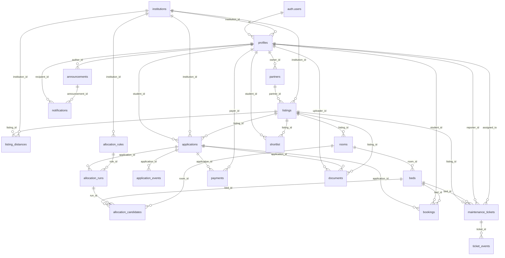

# StudentStay database diagram

Generated from the real foreign keys. Draws itself on GitHub.

```mermaid
erDiagram
  auth.users ||--o{ profiles : "id"
  institutions ||--o{ profiles : "institution_id"
  profiles ||--o{ partners : "owner_id"
  partners ||--o{ listings : "partner_id"
  institutions ||--o{ listings : "institution_id"
  listings ||--o{ listing_distances : "listing_id"
  institutions ||--o{ listing_distances : "institution_id"
  listings ||--o{ rooms : "listing_id"
  rooms ||--o{ beds : "room_id"
  profiles ||--o{ applications : "student_id"
  institutions ||--o{ applications : "institution_id"
  listings ||--o{ applications : "listing_id"
  applications ||--o{ application_events : "application_id"
  beds ||--o{ allocation_candidates : "bed_id"
  institutions ||--o{ allocation_rules : "institution_id"
  applications ||--o{ allocation_runs : "application_id"
  allocation_rules ||--o{ allocation_runs : "rule_id"
  allocation_runs ||--o{ allocation_candidates : "run_id"
  rooms ||--o{ allocation_candidates : "room_id"
  applications ||--o{ bookings : "application_id"
  profiles ||--o{ bookings : "student_id"
  beds ||--o{ bookings : "bed_id"
  applications ||--o{ payments : "application_id"
  profiles ||--o{ payments : "payer_id"
  listings ||--o{ maintenance_tickets : "listing_id"
  beds ||--o{ maintenance_tickets : "bed_id"
  profiles ||--o{ maintenance_tickets : "reporter_id"
  profiles ||--o{ maintenance_tickets : "assigned_to"
  maintenance_tickets ||--o{ ticket_events : "ticket_id"
  profiles ||--o{ announcements : "author_id"
  profiles ||--o{ notifications : "recipient_id"
  announcements ||--o{ notifications : "announcement_id"
  profiles ||--o{ documents : "uploader_id"
  applications ||--o{ documents : "application_id"
  listings ||--o{ documents : "listing_id"
  profiles ||--o{ shortlist : "student_id"
  listings ||--o{ shortlist : "listing_id"
```